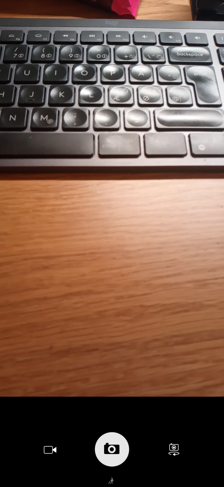

# Camera

Camera is a simple and easy to use camera for [Ubuntu
Touch](https://ubuntu-touch.io/). Main focus in this app is intuative and
simple UI and reliable operation to allow taking good pictures easily or in
other words: simple by default expansive when needed.

## Ubuntu Touch

This app is a core app for the [Ubuntu Touch](https://ubuntu-touch.io/) mobile
OS developed by [UBports](https://ubports.com/).

## Reporting Bugs and Requesting Features

Bugs and feature requests can be reported via our
[bug tracker](https://gitlab.com/ubports/development/apps/lomiri-camera-app/issues).

## Translating

This app can be translated on the [UBports Weblate](https://translate.ubports.com/projects/ubports/camera-app/).
We welcome translators from all different languages. Thank you for your contribution!

## Developing

To get started developing Camera install
[Clickable](https://clickable-ut.dev/en/latest/).
Then you can run `clickable build` from the root of this repository to build
and deploy Camera on your attached Ubuntu Touch device.

### Contributing

When contributing to this repository, please first discuss the change you wish
to make via issue, email, Matrix ( #ubcd:matrix.org ), or any other method with
the owners of this repository before making a change.  Please note we have a
[code of conduct](https://ubports.com/code-of-conduct), please follow it in all
your interactions with the project.

### Maintainer

This Ubuntu Touch core app is being maintained by the UBports developers.

See also the list of
[contributors](https://gitlab.com/ubports/development/apps/lomiri-camera-app/-/graphs/master)
who participated in this project.

### Releasing

New releases are automatically pushed to the OpenStore via the GitLab CI. To
make a new release a maintainer must:

- Increment the version in the manifest.json
- Create a new git commit, the commit message will become part of the automatic
  changelog in the OpenStore.
- Tag the commit with a tag starting with `v` (for example: `git tag v1.2.3`)
- Push the new commit and tag to GitLab: `git push && git push --tags`
- The GitLab CI will build and publish the new release to the OpenStore.

### Useful Links

- [UBports App Dev Docs](http://docs.ubports.com/en/latest/appdev/index.html)
- [UBports SDK Docs](https://api-docs.ubports.com/)
- [UBports](https://ubports.com/)
- [Ubuntu Touch](https://ubuntu-touch.io/)

## Donating

If you love Ubuntu Touch and its apps please consider dontating to the [UBports
Foundation](https://ubports.com/donate). Thanks in advance for your generous
donations.

## License

This program is free software: you can redistribute it and/or modify it under
the terms of the GNU General Public License version 3, as published by the Free
Software Foundation.
This program is distributed in the hope that it will be useful, but WITHOUT ANY
WARRANTY; without even the implied warranties of MERCHANTABILITY, SATISFACTORY
QUALITY, or FITNESS FOR A PARTICULAR PURPOSE.  See the GNU General Public
License for more details.
You should have received a copy of the GNU General Public License along with
this program.  If not, see http://www.gnu.org/licenses/.
